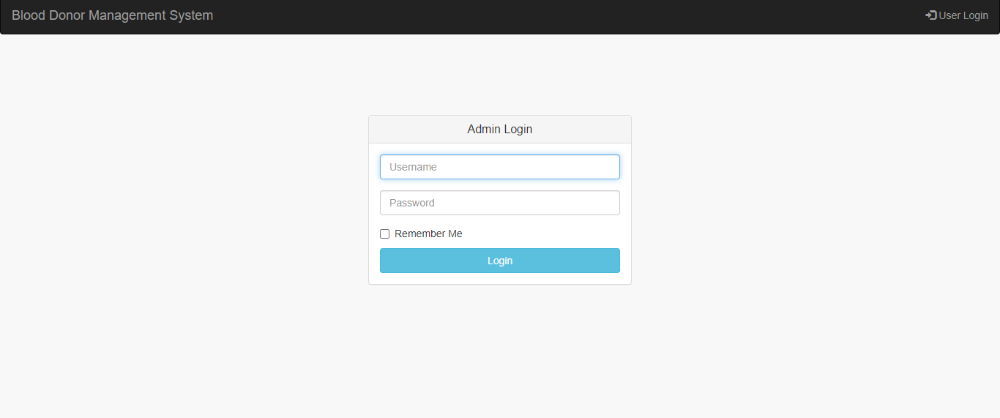
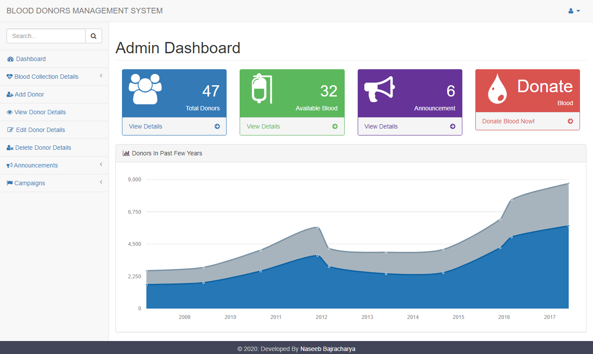
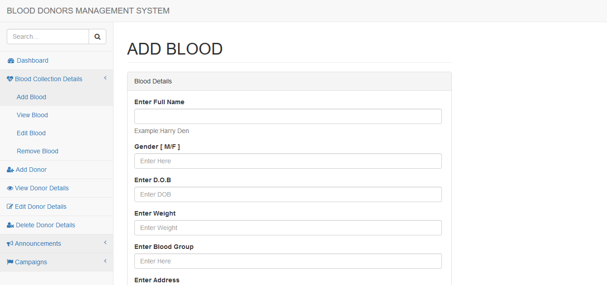
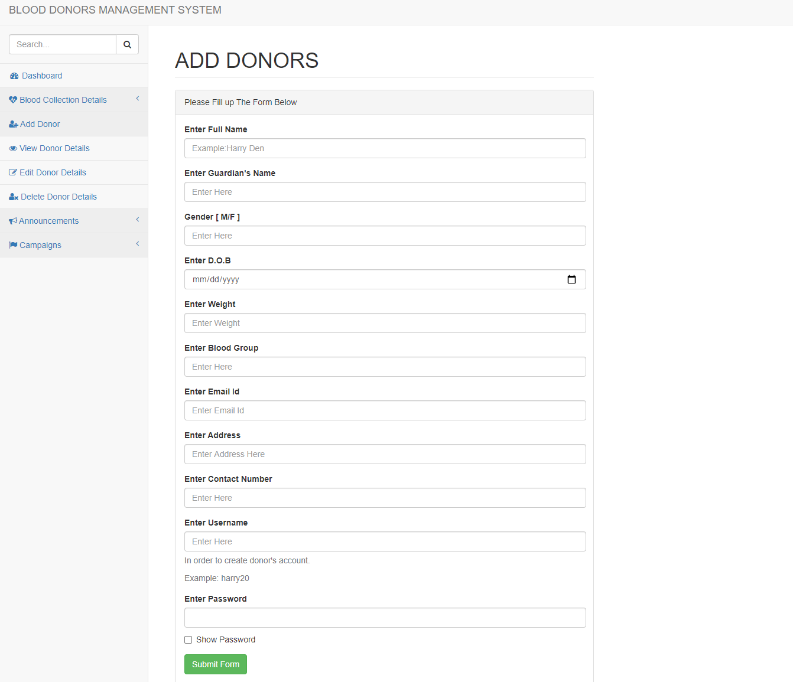
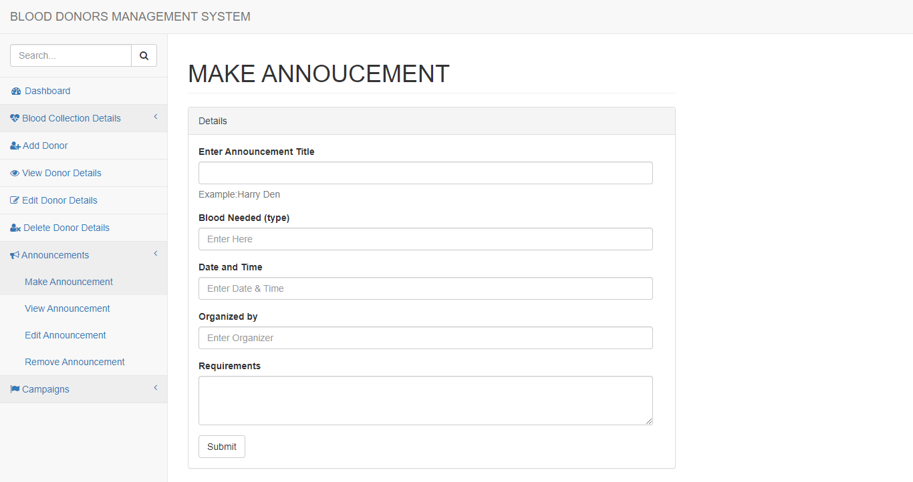
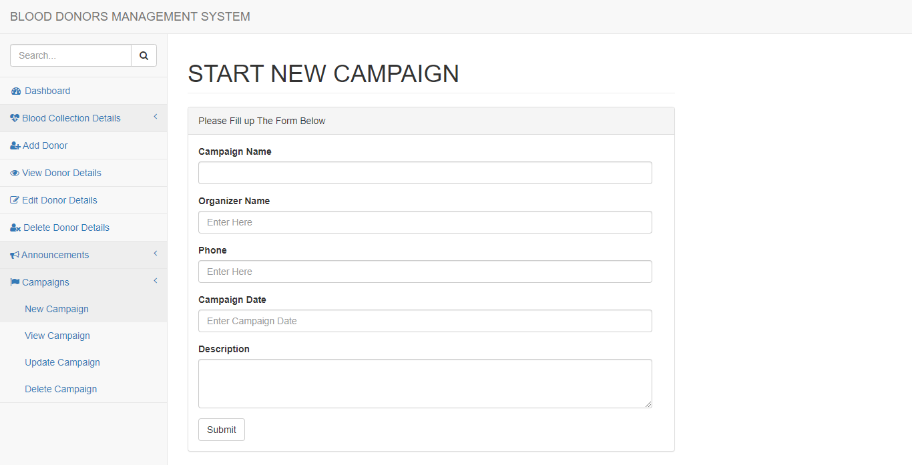
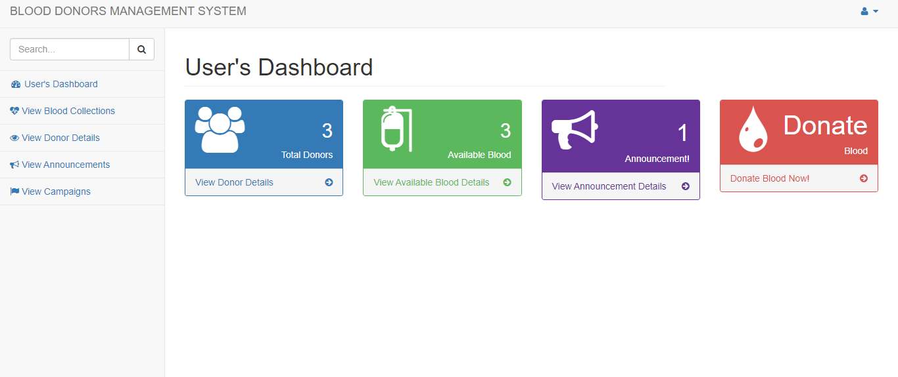

# Blood Bank System Using PHP
- With Startmin Open Source Admin Dashboard Template
- PHP
- MySQL Database
- HTML
- CSS
- Javascript

**UI Screenshots & some INITIAL UI CONCEPT**

- Login Panel

- Admin's Dashboard

- Add Blood Details Form

- Add Donor Details Form

- Announcement Form

- Campaign Form

- User Login

- User Dashboard

### Installation

- `git clone https://github.com/naseebbajracharya/bloodbanksystemphp`
- `Create Database, you'll find the files under folder named DATABASE`
- `Name DB as secyear`
- `Go to URL: http://localhost/[PROJECT_FOLDER_NAME]`